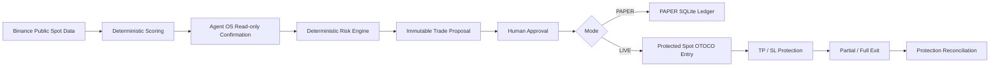

# RiskPilot

> **Binance Agent OS-powered Spot trading copilot with deterministic market scoring, deterministic risk controls, and human-approved live execution.**

**Analyze → Rank → Risk-check → Propose → Approve → Execute → Protect → Exit**

[](https://youtu.be/aYC23eYYUx0)
[](https://x.com/bobbymarc00/status/2097039814482878806)

[Public LIVE evidence bridge](docs/LIVE_EVIDENCE.md)

**Binance Agent OS Mini Hackathon — Track A**

---

## Overview

RiskPilot is a Spot trading copilot built around one principle:

> **AI can interact and orchestrate. Deterministic code defines the trading boundaries. Humans authorize real execution.**

RiskPilot combines:

* Binance public Spot market data
* deterministic market scoring
* narrowly scoped Binance Agent OS / MCP verification
* deterministic risk policy
* owner-bound human approval
* protected Spot execution
* position lifecycle management

RiskPilot can:

* read supported account state
* analyze supported Spot assets
* rank assets using a deterministic market score
* generate trade proposals
* enforce risk limits before execution
* require human approval for LIVE writes
* execute protected Spot entries
* maintain TP / SL protection
* perform partial exits
* re-arm protection for remaining quantity
* perform protected full exits
* validate Binance execution responses and protection state

The goal is not unrestricted autonomous trading.

The goal is **controlled agentic execution**.

---

## Live Demo

### YouTube

https://youtu.be/aYC23eYYUx0

### X Submission

https://x.com/bobbymarc00/status/2097039814482878806

The public demo uses **real funds** and shows a complete Spot position lifecycle.

### Demo Flow

1. Read the live Spot balance
2. Check open positions
3. Analyze XRP, BNB, and SOL
4. Rank assets using RiskPilot's deterministic market score
5. Generate a LIVE trade proposal
6. Approve the proposal
7. Execute a real Spot BUY
8. Arm TP / SL protection
9. Perform a partial exit
10. Re-arm protection for the remaining quantity
11. Fully exit the position
12. Verify the resulting history through Binance.com

This demonstrates:

**Account → Analysis → Risk → Approval → Execution → Protection → Position Management → Exit**

The final Binance.com history view in the video is an out-of-band verification step performed by the user, not a claim that RiskPilot exposes a general transaction-history reader.

---

## Why RiskPilot?

Many AI trading demos effectively stop at:

```text
Analyze → Buy
```

RiskPilot treats entry as only one part of the workflow:

```text
Analyze
   ↓
Rank
   ↓
Risk Check
   ↓
Proposal
   ↓
Human Approval
   ↓
Protected LIVE Execution
   ↓
TP / SL
   ↓
Partial Exit
   ↓
Re-arm Protection
   ↓
Full Exit
```

The important distinction is that the language-model-facing layer does not control trading limits.

Natural-language interaction and deterministic execution policy are deliberately separated.

---

## Architecture



RiskPilot separates:

```text
Observation
    ↓
Verification
    ↓
Policy
    ↓
Authorization
    ↓
Mutation
```

---

## Separation of Responsibilities

### Agent-facing layer

The agent-facing layer handles:

* natural-language interaction
* intent routing
* presentation and explanation
* narrowly scoped Agent OS orchestration

### Deterministic market engine

Deterministic code handles:

* technical-indicator calculation
* native market scoring
* score ranking
* candidate eligibility
* signal thresholds

### Deterministic risk engine

Deterministic code also enforces:

* per-entry limits
* exposure limits
* position and tranche limits
* stop-risk limits
* aggregate-risk limits
* daily and weekly loss limits
* duplicate and replay protection
* symbol allowlists
* paper/live separation
* live execution authorization
* proposal expiry
* execution leases

### Binance Agent OS / MCP

Agent OS / MCP is used only for narrowly scoped supported functions such as:

* read-only market confirmation
* account state required by LIVE workflows
* exact protected Spot execution
* protected-order management
* execution reconciliation

---

## Deterministic Market Scoring

RiskPilot does not ask the language model to invent a market score.

The canonical score engine calculates a native score from deterministic components including:

* EMA trend relationship
* close vs fast EMA
* RSI
* short-term momentum
* relative volume
* ATR range
* breakout condition

The final score is bounded between:

```text
0 → 100
```

The public example configuration uses:

```text
Minimum qualifying score: 70
```

Candidate eligibility also requires deterministic bullish conditions and allowlist membership.

Example:

```text
analyze XRP BNB SOL
```

RiskPilot returns exact native scores and ranks symbols deterministically.

---

## Binance Agent OS Integration

RiskPilot uses separate, narrowly scoped Binance Agent OS / MCP paths for market-data confirmation and protected LIVE execution.

### Market-data path

```text
Binance public Spot data
        ↓
60 closed candles
        ↓
Deterministic RiskPilot score
        ↓
Candidate
        ↓
Dedicated Agent OS read-only confirmation
        ↓
Exact candle / OHLC validation
```

Agent OS does **not** calculate RiskPilot's market score.

Agent OS does **not** choose the winning trading candidate.

Its role in this path is intentionally narrow: independent read-only confirmation.

---

## LIVE Execution Path

LIVE execution uses a separate dedicated execution profile.

RiskPilot only constructs fixed supported Spot write shapes.

### Supported LIVE write surface

* protected LIMIT BUY using OTOCO
* SELL OCO protection restore
* cancellation of the exact active protected OCO
* approved MARKET SELL exit
* ordered partial-exit workflow:

  * cancel current protection
  * sell approved quantity
  * re-arm TP / SL for remaining quantity

RiskPilot does not expose unrestricted Binance trading tools to the model.

---

## Human-in-the-Loop Execution

A market signal is not permission to move real funds.

The LIVE path requires:

```text
Immutable proposal
        +
Deterministic risk validation
        +
Supported Spot operation
        +
Dedicated execution profile
        +
Local LIVE arm
        +
Owner-bound human approval
        +
Binance response validation
        =
Eligible LIVE execution
```

Telegram or natural-language interaction cannot bypass the deterministic safety layer.

---

## Risk Guardrails

RiskPilot separates natural-language interaction from deterministic execution policy.

The public example configuration currently uses:

| Guardrail                              | Current repository configuration |
| -------------------------------------- | -------------------------------- |
| Market type                            | Spot only                        |
| Futures                                | Disabled                         |
| Margin                                 | Disabled                         |
| Withdrawals                            | Disabled                         |
| Transfers                              | Disabled                         |
| Convert / wallet / payment / borrowing | No supported execution route     |
| Human approval                         | Required for every LIVE write    |
| Default order size                     | 6 USDT                           |
| Legacy/PAPER-demo quote floor          | 5 USDT                           |
| Legacy/backstop LIVE entry             | 100 USDT                         |
| Legacy/backstop PAPER entry            | 100 USDT                         |
| Legacy/backstop open exposure          | 500 USDT                         |
| Maximum economic positions             | 5                                |
| Maximum active tranches                | 10                               |
| Legacy/schema-1 LIVE free reserve      | 8 USDT                           |
| Legacy/backstop risk per position      | 2 USDT                           |
| Legacy/backstop aggregate open risk    | 4 USDT                           |
| Legacy/backstop daily loss             | 5 USDT                           |
| Legacy/backstop weekly LIVE loss       | 20 USDT                          |
| Successful BUY entries / UTC day       | Maximum 10                       |
| Pending LIVE proposals                 | Maximum 1                        |
| Active proposals                       | Maximum 1                        |
| LIVE approval TTL                      | 180 seconds                      |
| Proposal TTL                           | 15 minutes                       |
| Execution lease                        | 300 seconds                      |
| Minimum reward:risk                    | 2.0                              |
| Minimum stop distance                  | 0.5%                             |
| Maximum stop distance                  | 3.0%                             |
| Maximum entry drift                    | 1.0%                             |
| Maximum spread                         | 0.25%                            |
| LIVE startup state                     | Disabled and disarmed            |
| LIVE arming                            | Local and time-limited           |
| Replay protection                      | Enabled                          |
| Paper/live separation                  | Enforced                         |
| Automatic ambiguous-write retry        | Disabled                         |

For legacy configs these monetary values remain the existing absolute limits.
The version-2 example instead derives entry, exposure, stop-risk, daily/weekly
loss, and reserve limits as percentages of Spot mark-to-market equity, so it
scales both down and up. The old USD values become a ceiling only when
`absolute_safety_caps.enabled` is explicitly enabled. See
[RiskPilot scalable equity-aware guardrails](docs/RISKPILOT_POLICY.md).

For every new LIVE entry, the policy takes a fresh authenticated snapshot of
Spot balances, open OCO orders, and bounded Spot trade history when the
proposal is created, claimed, and submitted. It fails closed if the 8 USDT
reserve in legacy/schema-1 mode—or the equity-percentage reserve in scalable
mode—plus exposure, tranche/position, per-position/aggregate-risk, or loss
limits would be exceeded. A pre-existing base balance without a matching
OCO, a historical sale whose cost basis cannot be proven from the bounded read,
or truncated history blocks a new LIVE entry pending reconciliation; RiskPilot
does not estimate a lower loss in those cases.

### Important: 6 USDT Is Neither a Target nor a Maximum

```text
risk.default_order_size_usdt = 6
```

is retained for legacy/manual compatibility. Under version-2 automated proposal
flow, the risk engine calculates size from the structural stop and current
account state.

It is **not** the maximum allowed trade size.

The public example configuration uses these primary limits:

```text
Position notional:       20% of equity
Maximum open exposure:   60% of equity
Risk per position:       0.5% of equity
Aggregate open risk:     1.5% of equity
Minimum free reserve:    20% of equity
Economic positions:      5
Active tranches:         10
```

Actual executable size is still constrained by:

* available Spot balance
* percentage-based free-quote reserve
* Binance exchange filters
* per-entry maximum
* total exposure
* risk limits
* active position limits
* daily limits

RiskPilot does not silently increase an order amount merely to satisfy an exchange minimum-notional requirement.

---

## Supported Symbols

The current public example allowlist contains:

```text
BTCUSDT
ETHUSDT
BNBUSDT
SOLUSDT
XRPUSDT
```

Unsupported symbols fail closed.

---

## Protected Entry

RiskPilot's LIVE entry path is designed around a protected Spot order list.

```text
Approved LIVE proposal
        ↓
Exchange filter validation
        ↓
LIMIT BUY
        +
Take Profit
        +
Stop Loss
        ↓
Spot OTOCO
```

The entry and protective bracket are derived from the immutable approved proposal.

There is no unprotected MARKET BUY fallback in the LIVE entry path.

---

## Partial Exit

RiskPilot supports protected partial exits.

The workflow is intentionally ordered:

```text
Existing protected position
        ↓
Cancel exact active OCO
        ↓
Confirm protection cancellation
        ↓
Check free Spot balance
        ↓
MARKET SELL approved quantity
        ↓
Calculate remaining quantity
        ↓
Re-arm OCO using existing TP / SL
```

If the protection cancellation cannot be verified safely, the workflow requires reconciliation rather than blindly continuing.

---

## Full Exit

A protected full exit follows the same fail-closed philosophy.

```text
Protected position
        ↓
Cancel exact active protection
        ↓
Validate executable quantity
        ↓
Approved MARKET SELL
        ↓
Verify execution result
```

RiskPilot does not expose arbitrary order cancellation.

The cancellation route is limited to the exact active protection associated with the approved position workflow.

---

## Paper vs LIVE

RiskPilot supports separate PAPER and LIVE execution paths.

### PAPER

PAPER mode supports:

* simulated fills
* scale-in
* position accounting
* partial close
* full close
* automatic TP / SL
* risk-limit enforcement
* restart recovery
* proposal replay protection

The public example starts with:

```text
mode = paper
```

### LIVE

LIVE mode requires explicit readiness.

The public example configuration starts with:

```text
live.enabled = false
live.armed = false
execution_ready = false
```

LIVE must be explicitly prepared and locally armed.

Natural-language intent alone cannot arm LIVE execution.

---

## Scanner Status

> **The scheduled scanner is implemented but currently operationally disabled while Binance public REST request budgeting and rate-limit / IP-ban protection are being optimized.**

The scanner implementation remains in the repository and has offline/synthetic evaluation coverage.

When enabled, the intended workflow is:

```text
Public Binance Spot data
        ↓
Deterministic prefilter
        ↓
Top candidate
        ↓
Agent OS read-only confirmation
        ↓
Risk engine
        ↓
Proposal
```

Manual analysis remains available separately.

---

## Fail-Closed Design

RiskPilot prefers rejecting an unsafe or ambiguous operation over weakening the configured policy.

Examples:

```text
Unsupported symbol
→ reject

Quote amount outside configured bounds
→ reject

Maximum exposure reached
→ reject

Position/tranche limit reached
→ reject

Daily loss limit reached
→ reject

Reward:risk below minimum
→ reject

Spread too wide
→ reject

Entry drift too large
→ reject

Stop distance outside allowed range
→ reject

Invalid TP / SL bracket
→ reject

Proposal expired
→ reject

LIVE not armed
→ reject

Invalid approval
→ reject

Unknown or ambiguous write result
→ reconcile; do not automatically retry
```

---

## Replay and Restart Safety

RiskPilot includes safeguards for durable execution workflows.

These include:

* canonical proposal payloads
* proposal hashes
* owner/chat binding
* nonces
* proposal expiry
* single-use claims
* execution leases
* idempotent fills
* SQLite transactions
* restart recovery
* append-only audit evidence

The objective is to prevent duplicate execution after:

* repeated approval
* timeout
* process restart
* ambiguous command delivery

---

## Example Interaction

### Balance

```text
User:
check my balance and open position

RiskPilot:
LIVE SPOT BALANCE

• USDT: ...
• XRP: ...
```

### Market Analysis

```text
User:
analyze XRP BNB SOL

RiskPilot:
RiskPilot · Market-score ranking
...
```

### LIVE Proposal

```text
User:
buy 10 usd of XRP

RiskPilot:
LIVE TRADE PROPOSAL

Symbol: XRPUSDT
Side: BUY
Amount: 10 USDT
Entry: ...
Stop: ...
Target: ...

Awaiting approval.
```

No real order exists merely because the proposal was created.

### Execution

After the required approval and LIVE safety gates pass:

```text
RiskPilot:
LIVE execution confirmed.

Protected Spot entry submitted.
TP / SL protection active.
```

---

## Telegram Interaction

Examples supported by the project include:

```text
/spot paper balance
/spot paper positions
/spot paper-buy SOL 25

buy 25 usd of SOL
paper buy 25 usd of SOL

sell XRP 47%
sell all XRP

restore TP SL XRP

paper sell 70% SOL
```

Normal trading intent defaults to a protected LIVE proposal unless `paper` is explicitly requested.

Creating a LIVE proposal does not itself execute an order.

LIVE execution remains gated by approval and local arm state.

---

## CLI Examples

```bash
./riskpilot --config config.example.json --json status

./riskpilot --config config.example.json --json paper balance

./riskpilot --config config.example.json --json paper positions

./spotguard --config config.example.json --json scan --synthetic --dry-run

./spotguard --config config.example.json --json live status

./riskpilot --json agent-os status
```

---

## Quick Start

### Requirements

* Linux / macOS environment
* Bash
* Python 3.10+
* SQLite
* OpenClaw for Telegram integration
* Codex CLI for optional Agent OS integration
* Binance Agent OS / MCP access for Agent OS workflows

### Clone

```bash
git clone https://github.com/bobbymarc00/riskpilot.git
cd riskpilot
```

### Create local configuration

```bash
cp config.example.json config.json
chmod 600 config.json
```

Do not commit `config.json`.

### Validate configuration

```bash
./riskpilot --config config.json --json check
```

### Run the offline Track A demo

```bash
./scripts/demo-track-a.sh
```

The local demo uses isolated temporary state and does not require LIVE Binance execution.

---

## Reproducible Evaluation

Run:

```bash
./scripts/demo-track-a.sh
./scripts/verify.sh
```

The repository includes tests covering areas such as:

* deterministic market scoring
* Agent OS boundary validation
* configuration validation
* Telegram approval
* durable approval
* replay rejection
* PAPER proposal flow
* PAPER position accounting
* scale-in
* partial close
* automatic PAPER TP / SL
* tranche and position limits
* daily-entry quota
* execution recovery
* restart recovery
* LIVE safety
* symbol expansion
* localization

See:

* `docs/EVALUATION.md`
* `docs/ARCHITECTURE.md`
* `docs/SECURITY.md`
* `docs/SCORE_ENGINE.md`

---

## Security Model

RiskPilot follows a least-authority design.

### Market analysis profile

The read-only Agent OS path is isolated and narrowly scoped.

It does not accept:

* shell operations
* file operations
* trade writes
* transfer operations
* arbitrary MCP tools

### LIVE execution profile

LIVE execution uses a separate dedicated profile and fixed direct MCP envelopes.

The intended LIVE surface excludes:

```text
Futures
Margin
Convert
wallet operations
transfers
payments
borrowing
withdrawals
arbitrary model-selected writes
```

Credentials belong in external runtime / OAuth stores.

They must never be committed into the repository.

---

## Secret Hygiene

Never commit:

```text
API keys
OAuth credentials
Telegram bot tokens
private session tokens
Binance account credentials
private account information
signing secrets
```

The repository should only contain sanitized configuration examples.

---

## Repository Structure

Key project areas:

```text
riskpilot/
├── src/spotguard/
│   ├── cli.py
│   ├── codex_bridge.py
│   ├── config.py
│   ├── db.py
│   ├── indicators.py
│   ├── intent.py
│   ├── live_execution.py
│   ├── market.py
│   ├── paper.py
│   ├── policy.py
│   ├── score_engine.py
│   ├── security.py
│   ├── service.py
│   ├── strategy.py
│   └── telegram.py
│
├── tests/
│
├── docs/
│   ├── ARCHITECTURE.md
│   ├── EVALUATION.md
│   ├── LIVE_EXECUTION_SETUP.md
│   ├── OPERATIONS.md
│   ├── SCORE_ENGINE.md
│   └── SECURITY.md
│
├── schemas/
├── scripts/
├── systemd/
├── skills/
│
├── config.example.json
├── config.execution.example.toml
├── pyproject.toml
├── LICENSE
├── riskpilot
└── spotguard
```

---

## Design Principles

### 1. Scoring is deterministic

The LLM does not invent ranking scores.

### 2. Risk is deterministic

The model cannot override execution limits.

### 3. Proposals are immutable

Execution is bound to the approved payload.

### 4. LIVE requires human authorization

Analysis is not permission to trade.

### 5. LIVE requires local arming

Remote language input cannot independently enable LIVE.

### 6. Spot only

Unsupported product families fail closed.

### 7. Protected entry first

No unprotected LIVE MARKET BUY fallback.

### 8. Ambiguous writes are not retried automatically

RiskPilot requires reconciliation.

### 9. Partial exits preserve protection

Remaining quantity is re-protected after an approved partial exit.

### 10. Real funds are used only to prove the execution architecture

The demo is not intended to demonstrate profitability.

---

## What RiskPilot Is Not

RiskPilot is not:

* a guaranteed-profit bot
* a high-frequency trading system
* an unrestricted autonomous trader
* a Futures bot
* a Margin bot
* an LLM with unlimited Binance account permissions
* a system that allows natural-language instructions to bypass policy
* a system that automatically retries unknown financial writes

---

## Hackathon Submission

**Binance Agent OS Mini Hackathon — Track A**

### Live Demo

https://youtu.be/aYC23eYYUx0

### X Submission

https://x.com/bobbymarc00/status/2097039814482878806

### Demonstrated LIVE Capabilities

* live Binance Spot account interaction
* multi-asset analysis
* deterministic ranking
* LIVE proposal generation
* human approval
* real-fund Spot BUY
* protected TP / SL lifecycle
* partial exit
* protection re-arm
* full exit
* out-of-band Binance.com history verification

### Repository Capabilities

* deterministic score engine
* Agent OS read-only confirmation path
* PAPER trading lifecycle
* durable approval
* replay protection
* restart recovery
* LIVE Spot execution adapter
* protected OTOCO entry
* OCO protection restore
* exact protection cancellation
* protected partial exit
* protected full exit
* fail-closed reconciliation behavior
* automated test coverage

---

## Disclaimer

RiskPilot is experimental hackathon software.

It is not financial advice and does not guarantee profitability or trading performance.

Cryptocurrency trading involves financial risk.

Users remain responsible for:

* reviewing trade proposals
* approving LIVE execution
* securing their Binance account
* controlling account permissions
* complying with Binance terms
* complying with applicable regional laws and regulations

---

## Links

* **GitHub:** https://github.com/bobbymarc00/riskpilot
* **YouTube Demo:** https://youtu.be/aYC23eYYUx0
* **X Submission:** https://x.com/bobbymarc00/status/2097039814482878806

---

## Final Principle

> **AI can interact. Deterministic code defines the boundaries. Humans authorize real execution.**
