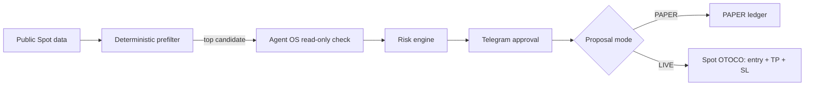

# RiskPilot

**Agent OS-powered Spot trading copilot**

**Scan. Verify. Approve. Protect.**

RiskPilot scans Binance Spot markets, verifies qualifying signals through Agent OS, applies deterministic risk controls, and routes immutable Spot trade proposals to Telegram for explicit human approval.

> Binance Agent OS Mini Hackathon — Track A · Categories: Trading Workflows and Data & Analysis
> Execution model: PAPER is explicit; normal buy intent creates a protected LIVE proposal, which remains disarmed until the VPS owner arms it locally.

**Problem:** trading assistants often blur analysis, authority, and execution.
**Solution:** RiskPilot separates deterministic scanning, narrowly scoped AI verification, risk policy, owner-bound approval, and protected Spot execution.

[Architecture](docs/ARCHITECTURE.md) · [Security](docs/SECURITY.md) · [Evaluation evidence](docs/EVALUATION.md) · [Submission](docs/HACKATHON_SUBMISSION.md) · [Contributing](CONTRIBUTING.md)

## Quick start

Create a private configuration from `config.example.json`, keep `mode` as `paper`, and run the deterministic offline demo:

```bash
./scripts/demo-track-a.sh
```

The demo creates an isolated temporary ledger, uses fixture market data, sends no Telegram messages, and has no Binance write path. See [the reproducible demo flow](docs/DEMO.md). The externally hosted demo video will be linked here before publication: `DEMO_VIDEO_URL`.

RiskPilot keeps technical JSON fields and command tokens stable while presenting Telegram results in deterministic English or Indonesian. New configurations default to English; existing configurations retain the compatibility fallback until `presentation.default_locale` is set.

## Thirty-second overview

### Dedicated Binance MCP profile

Agent OS analysis and protected execution are fail-closed until `codex.agent_os_home` and
`codex.agent_os_workspace` name an explicit dedicated Codex profile. The
example intentionally leaves both `null`; RiskPilot never falls back to the
caller environment or `~/.codex`. Binance MCP read-only: Agentic account +
market data. RiskPilot requests only `tool_execute -> spot.klines`, validates
the generic outer tool and inner target, and performs no account read or write.
The provider may return the currently forming candle: one request asks for
three raw candles and RiskPilot uses only the two newest that are closed after
a configurable two-second close grace.

### Scanner status — temporarily disabled

The scheduled scanner is deliberately **disabled** while its public-data path is optimized. Scanning a broad USDT allowlist caused repeated Binance public REST throttling (`HTTP 429`, and later `HTTP 418`), which can lead to a temporary IP ban. No scanner timer is active and no background scan or notification is currently sent.

The planned safe re-enable path is: choose a small liquidity-ranked universe (target: 20 symbols by 24-hour quote volume), cache/bulk-read `exchangeInfo`, fetch only the required 15-minute candles, add bounded retry/backoff, and notify Telegram only for qualified candidates. A five-minute cadence remains the design target; it is not active until this work is verified. Manual multi-symbol analysis remains read-only but should be used sparingly while Binance is throttling.

**Demo video:** pending owner upload (owner asset).

## Why RiskPilot?

RiskPilot is more than an indicator script or Telegram bot:

- Two-stage design avoids spending model tokens on every scan.
- Exact candle matching independently verifies qualified candidates.
- Human approval is cryptographically bound to an immutable proposal.
- Risk and exposure are enforced before proposal and approval.
- PAPER supports scale-in, aggregate accounting, and partial/full close.
- Replay protection and execution-lease recovery survive restarts.
- PAPER is explicit; normal trading intent creates a LIVE proposal that still requires a native approval button.
- Live Spot exits preserve protection: partial exit cancels the exact OCO, sells the approved rounded amount, then re-arms unchanged TP/SL for the remainder.
- Timeout, denial, stale data, malformed output, mismatch, and invalid brackets fail closed.

## How RiskPilot Uses Binance Agent OS

Scheduled scans and manual analysis share the exact native score engine. Both score the same 60 validated closed candles from the Binance public REST prefilter; Binance Agent OS independently confirms the newest closed candle. Analysis reports market score separately from a read-only hypothetical PAPER eligibility projection and never creates a proposal. See [the score-engine audit](docs/SCORE_ENGINE.md) for the exact formula, weights, thresholds, and compatibility fixtures.

1. Manual analysis uses deterministic Binance public Spot data.
2. Only a qualified candidate would trigger Agent OS after the scanner is re-enabled.
3. Agent OS performs a fixed read-only `spot.klines` confirmation.
4. RiskPilot compares candle open time and exact OHLC values.
5. Mismatch, timeout, denial, malformed output, or unexpected MCP activity fails closed.
6. The model cannot choose symbol, product, side, amount, or risk values.
7. Sanitized evidence is recorded in the audit ledger.

```json
{"event":"candidate.agent_os_confirmed","symbol":"BTCUSDT","interval":"15m","mcp_server":"binance-mcp-server","tool":"spot.klines","matched":true}
```

Manual and fixture PAPER proposals do not claim Agent OS confirmation.

## End-to-end workflow



## Demonstrated capabilities

| Capability | Status |
|---|---|
| Scheduled scanner | Implemented, but **operationally disabled** during rate-limit/IP-ban optimization |
| Agent OS exact-candle confirmation | Implemented · read-only |
| PAPER proposal, fill, scale-in, partial close | Implemented · tested |
| Automatic PAPER stop-loss/take-profit | Implemented · tested |
| Replay, expiry, lease, restart recovery | Implemented · tested |
| LIVE protected Spot entry (OTOCO) | Implemented · owner-confirmed · locally armed only |
| LIVE TP/SL restore, partial exit, and protected full exit | Implemented · owner-confirmed · locally armed only |

## Safety and fail-closed design

- Spot-only configured allowlist. No Futures, Margin, Convert, wallet, transfer, payment, borrowing, or withdrawal route exists.
- The only cancellation route is owner-approved cancellation of the exact active Spot TP/SL OCO list; it cannot cancel arbitrary orders.
- No routine scan write exists; every live write begins with an immutable proposal and a native Telegram confirmation.
- Natural-language buy and sell default to LIVE proposals; prefix `paper` for the explicit PAPER alternative.
- `sell SYMBOL 47%` cancels the exact active OCO, sells an exchange-rounded protected amount, and re-arms unchanged TP/SL. `sell all SYMBOL` cancels OCO and exits the protected quantity without re-arming.
- Approval is owner/chat bound, expiring, single-use, and payload-bound.
- Long brackets require `stop < aggregate average < take-profit`.
- LIVE requires a dedicated execution profile, local arm, protected OTOCO request, native Telegram confirmation, and reconciliation on any ambiguous result.

See [Security](docs/SECURITY.md).

## Reproducible quick demo

### 60-second local evaluation

```bash
./scripts/demo-track-a.sh
./scripts/demo-track-a.sh
./scripts/verify.sh
./spotguard --config config.example.json --json live status
```

The demo uses a new temporary database, mocked market reads, disabled Telegram, and no Binance write. Optional real read-only Agent OS check:

```bash
./riskpilot --json agent-os market --symbol BTCUSDT
```

## Telegram commands

```text
/spot paper balance
/spot paper positions
/spot paper-buy SOL 25
buy 25 usd of SOL          # LIVE proposal; no order yet
paper buy 25 usd of SOL    # explicit PAPER proposal
sell XRP 47%                 # LIVE protected partial-exit proposal
sell all XRP                 # LIVE protected full-exit proposal
restore TP SL XRP            # LIVE proposal restoring the last approved bracket
paper sell 70% SOL           # explicit PAPER partial close
```

`/spot` is the registered Telegram route; `/risk` is not registered. Text creates proposals only. LIVE controls are short native `/binance_spotguard live-approve PROPOSAL_ID` and `live-reject PROPOSAL_ID` command buttons, so they survive OpenClaw's generic-callback handling.

```bash
./riskpilot --config config.example.json --json status
./riskpilot --config config.example.json --json paper balance
./riskpilot --config config.example.json --json paper positions
./spotguard --config config.example.json --json scan --synthetic --dry-run
./spotguard --config config.example.json --json live status
./spotguard --help
```

Global flags precede subcommands. Success exits 0; validation/policy/security failures exit 2.

## Installation

Prerequisites: Bash, Python 3.10+, SQLite; OpenClaw for Telegram; Codex CLI only for optional Agent OS confirmation.

```bash
git clone REPOSITORY_URL riskpilot-agent-os
cd riskpilot-agent-os
cp config.example.json config.json
chmod 600 config.json
./riskpilot --config config.json --json check
```

Replace `REPOSITORY_URL`, `OWNER_ID`, and `TELEGRAM_CHAT_ID` locally. Never commit `config.json`.

## Configuration

The example profile caps both PAPER and LIVE proposals at 100 USDT per entry and 500 USDT exposure. `risk.default_order_size_usdt=6` is the **default order size** used by read-only analysis when the user supplies no hypothetical amount; it is not a risk maximum or permission to create/fill a proposal. The legacy `default_quote_amount` spelling remains accepted without rewriting existing configuration. The remaining example limits are 10 tranches, 5 economic positions, 2 USDT position risk, 4 USDT aggregate risk, 5 USDT daily realized-loss cap, and 10 successful BUY entries/UTC day. LIVE also retains an 8 USDT reserve and one pending proposal maximum.

Keep `live.armed=false` in configuration. Enable/arm only through the documented local interactive command. A roughly 28 USDT account cannot support a 100 USDT entry plus the configured 8 USDT reserve at the maximum 100 USDT entry; use an amount compatible with your balance.

Legacy internal `spotguard` names preserve installed state and approvals; see [Compatibility](docs/COMPATIBILITY.md).

## Testing, limitations, and disclaimer

Run `./scripts/verify.sh`. CI is offline and has no write-capable transport. See [Evaluation](docs/EVALUATION.md).

PAPER fills are models, not exchange fills. LIVE execution is experimental: every Spot write—entry, OCO restore, OCO cancel, partial exit, or full exit—requires a local arm and native confirmation. Ambiguous results never retry automatically and require reconciliation. The scheduled scanner is currently disabled because broad public REST polling triggered Binance throttling/IP-ban risk; see [Operations](docs/OPERATIONS.md). Screenshots/video remain owner-supplied.

RiskPilot is experimental hackathon software, not financial advice, and provides no profit guarantee.
