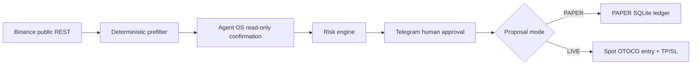

# RiskPilot architecture

## Dedicated Agent OS market-data path

`analyze` aliases first use the scheduled pipeline's public REST path and
canonical 60-closed-candle score. RiskPilot then uses the dedicated Codex
profile/neutral workspace -> `binance-marketdata` -> `tool_execute` ->
`spot.klines` solely for confirmation. One raw three-candle response is reduced
to two closed candles using a two-second close grace. JSONL evidence, Decimal
OHLC checks, timestamp gap, and freshness are validated before output. The
structured result labels the score and confirmation sources separately.

RiskPilot separates observation, verification, policy, authorization, and mutation.

1. The retained compatibility timer invokes the scheduled scan every five minutes.
2. Public Binance Spot REST supplies exchange filters, book ticker data, and 61 15-minute candles.
3. Deterministic analysis uses 60 closed candles, per-symbol deduplication, and score/freshness ranking.
4. At most one top candidate is confirmed through one fixed Agent OS read-only `spot.klines` request.
5. Exact candle time/OHLC matching gates deterministic proposal logic.
6. Telegram carries immutable proposal details and owner-bound controls.
7. PAPER execution updates SQLite atomically; LIVE execution submits one owner-approved Spot OTOCO envelope and records an ambiguous outcome as RECONCILE without retry.

Scoring does not use Agent OS. Agent OS is a narrow confirmation stage after the public-data prefilter.

SQLite uses WAL, busy timeout, transactions, proposal leases, idempotent fills, epoch-aware accounting, and append-only audit evidence. Legacy internal identifiers keep existing ledgers readable.

LIVE is isolated behind an adapter that constructs only `spot.orderList.place.otoco`: LIMIT BUY, then pending SELL take-profit and stop-loss OCO legs. It requires a dedicated profile, local arm, native Telegram confirmation, exact MCP event matching, and reconciliation on failure.
