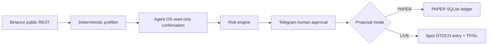

# RiskPilot architecture

## Dedicated Agent OS market-data path

`analyze` aliases first use the scheduled pipeline's public REST path and
canonical 60-closed-candle score. RiskPilot then uses the dedicated Codex
profile/neutral workspace -> `binance-marketdata` -> `tool_execute` ->
`spot.klines` solely for confirmation. One raw three-candle response is reduced
to two closed candles using a two-second close grace. JSONL evidence, Decimal
OHLC checks, timestamp gap, and freshness are validated before output. The
structured result labels the score and confirmation sources separately.

RiskPilot separates observation, verification, policy, authorization, and mutation.

1. The retained scanner timer is currently disabled during public-REST rate-limit/IP-ban optimization; it must not be enabled until its request budget is verified.
2. When enabled, public Binance Spot REST supplies cached exchange filters, bounded book-ticker data, and 61 15-minute candles from a small liquidity-ranked universe.
3. Deterministic analysis uses 60 closed candles, per-symbol deduplication, and score/freshness ranking.
4. At most one top candidate is confirmed through one fixed Agent OS read-only `spot.klines` request.
5. Exact candle time/OHLC matching gates deterministic proposal logic.
6. Telegram carries immutable proposal details and owner-bound controls.
7. PAPER execution updates SQLite atomically. LIVE supports owner-approved Spot OTOCO entry, OCO restore, exact-OCO cancel, protected partial exit, and protected full exit. An unresolved write outcome is persisted as `RECONCILE` and is never automatically retried.

Scoring does not use Agent OS. Agent OS is a narrow confirmation stage after the public-data prefilter.

SQLite uses WAL, busy timeout, transactions, proposal leases, idempotent fills, epoch-aware accounting, and append-only audit evidence. Legacy internal identifiers keep existing ledgers readable.

LIVE is isolated behind an adapter that constructs a narrow allowlist of fixed Spot write shapes: protected LIMIT BUY OTOCO, SELL OCO restore, exact protected-OCO cancellation, and exact MARKET SELL exit. It requires a dedicated profile, local arm, native Telegram confirmation, response validation, and post-cancel order-list verification.

Reconciliation is intentionally bounded: the partial-exit path performs a targeted open-order read-back when OCO cancellation acknowledgement is ambiguous. Other ambiguous financial writes transition to `RECONCILE`; generic automatic recovery is not implemented and the request is not blindly retried.

See [LIVE_EVIDENCE.md](LIVE_EVIDENCE.md) for the public real-funds evidence bridge and the exact offline-versus-LIVE evidence boundary.
